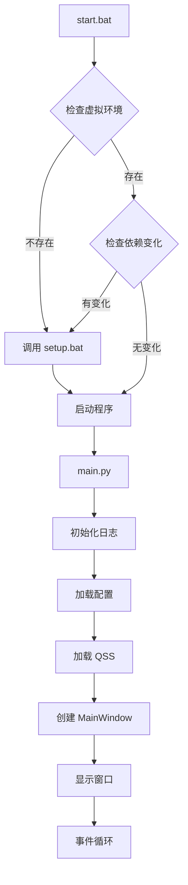
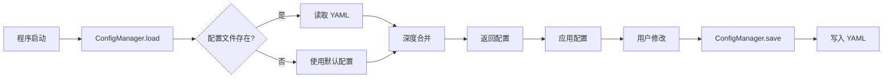
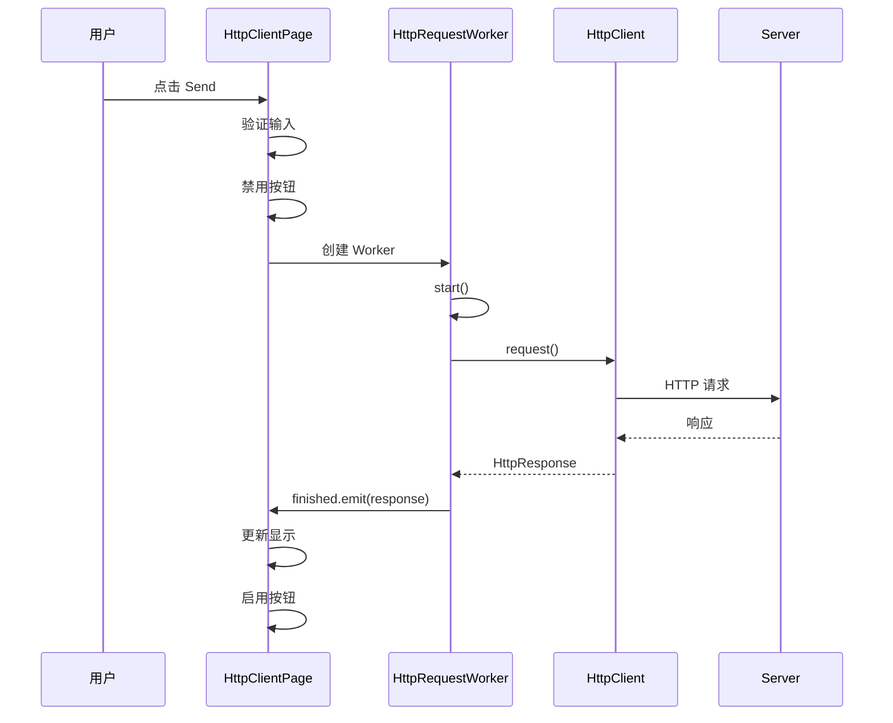
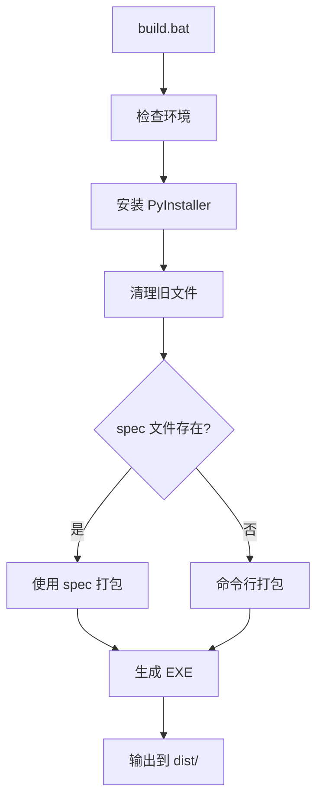

# PyQt EXE Template - Architecture Documentation

## 项目设计目标

本项目旨在提供一个通用的、现代化的 PyQt6 桌面应用程序模板，具备以下核心能力：

1. **开箱即用** - 完整的项目结构，无需从零开始
2. **现代化 UI** - 深色主题，美观的界面设计
3. **HTTP 能力** - 内置 HTTP 客户端，支持 API 测试
4. **配置管理** - YAML 配置系统，支持持久化
5. **易于打包** - PyInstaller 一键打包为 Windows EXE
6. **可扩展** - 清晰的模块划分，便于添加新功能

## 为什么使用 PyQt 而不是 pywebview

### PyQt 的优势

| 特性 | PyQt | pywebview |
|------|------|-----------|
| 性能 | 原生控件，高性能 | 依赖浏览器引擎 |
| 体积 | 较小 | 需要打包浏览器 |
| 兼容性 | Windows/Mac/Linux | 依赖系统浏览器 |
| UI 控制 | 完全控制 | 受限于 Web 技术 |
| 调试 | 原生调试工具 | 需要 Web 调试 |

### 选择 PyQt 的原因

1. **原生体验** - PyQt 提供真正的原生桌面体验
2. **无外部依赖** - 不依赖用户系统安装的浏览器
3. **更好的性能** - 直接使用系统控件，无需 Web 渲染
4. **更小的打包体积** - 不需要打包整个浏览器引擎
5. **更稳定** - 不受浏览器版本更新影响

## 项目目录说明

```
pyqt-exe-template/
├── config/               # 配置文件目录
│   └── setting.yaml      # YAML 格式配置
│
├── script/               # Python 源码目录
│   ├── main.py           # 程序入口
│   ├── gui.py            # UI 界面
│   ├── config_manager.py # 配置管理
│   ├── network.py        # 网络请求
│   ├── logger.py         # 日志系统
│   ├── paths.py          # 路径处理
│   └── utils.py          # 工具函数
│
├── resources/            # 资源文件目录
│   ├── icons/            # 图标
│   ├── images/           # 图片
│   └── styles/           # QSS 样式
│
├── rundata/              # 运行时数据目录
│   ├── input/            # 输入文件
│   ├── output/           # 输出文件
│   └── logs/             # 日志文件
│
└── docs/                 # 文档目录
```

## 启动流程



### 启动步骤详解

1. **start.bat** 检查环境
   - 检查 `.venv` 是否存在
   - 检查 `requirements.txt` 是否变化
   - 必要时调用 `setup.bat`

2. **main.py** 初始化应用
   - 初始化日志系统
   - 加载配置文件
   - 加载 QSS 样式表
   - 创建 QApplication
   - 创建并显示 MainWindow

3. **MainWindow** 初始化 UI
   - 创建导航栏
   - 创建页面堆栈
   - 连接信号槽
   - 恢复窗口状态

## UI 架构

### 窗口结构

```
MainWindow
├── QMenuBar (菜单栏)
├── QToolBar (工具栏)
├── Central Widget
│   ├── NavWidget (导航栏)
│   │   ├── Logo Label
│   │   └── Nav Buttons
│   └── Content Widget (内容区)
│       └── QStackedWidget
│           ├── DashboardPage
│           ├── HttpClientPage
│           ├── SettingsPage
│           └── AboutPage
└── QStatusBar (状态栏)
```

### 页面切换机制

使用 `QStackedWidget` 实现页面切换：

```python
# 切换页面
def _switch_page(self, index: int):
    self.page_stack.setCurrentIndex(index)
    # 更新导航按钮状态
    for i, btn in enumerate(self.nav_buttons):
        btn.setChecked(i == index)
```

### HTTP 请求异步处理

使用 `QThread` 避免 UI 阻塞：

```python
class HttpRequestWorker(QThread):
    finished = pyqtSignal(object)
    error = pyqtSignal(str)
    
    def run(self):
        # 在后台线程执行 HTTP 请求
        response = client.request(...)
        self.finished.emit(response)
```

## 配置管理流程



### 配置管理特性

1. **自动创建** - 配置文件不存在时自动创建
2. **深度合并** - 文件配置与默认配置深度合并
3. **点分路径** - 支持 `get('app.name')` 形式访问
4. **路径解析** - 自动处理相对路径和绝对路径

## HTTP 请求流程



### HTTP 客户端特性

1. **统一响应结构** - `HttpResponse` dataclass
2. **超时控制** - 可配置超时时间
3. **重试机制** - 自动重试失败请求
4. **错误处理** - 异常不会导致程序崩溃

## 打包流程



### PyInstaller 配置要点

1. **单文件模式** - `--onefile`
2. **无控制台** - `--windowed`
3. **资源打包** - `--add-data`
4. **隐式导入** - `--hidden-import`

## PyInstaller 资源路径注意事项

### 问题

打包后，资源文件被解压到临时目录 `sys._MEIPASS`，而不是 EXE 所在目录。

### 解决方案

`paths.py` 模块自动处理路径：

```python
def get_resource_dir() -> Path:
    if getattr(sys, 'frozen', False):
        # 打包后：使用临时目录
        meipass = getattr(sys, '_MEIPASS', None)
        if meipass:
            return Path(meipass) / 'resources'
    else:
        # 开发环境：使用项目目录
        return get_app_dir() / 'resources'
```

### 使用方式

```python
from script.paths import resource_path

# 正确：自动适配开发/打包环境
qss_path = resource_path('styles/modern.qss')

# 错误：打包后路径不正确
qss_path = Path('resources/styles/modern.qss')
```

## 后续扩展建议

### 1. 多语言支持 (i18n)

```python
# 使用 QTranslator
from PyQt6.QtCore import QTranslator

translator = QTranslator()
translator.load('translations/zh_CN.qm')
app.installTranslator(translator)
```

### 2. 插件系统

```python
# 插件接口
class PluginInterface:
    def get_name(self) -> str: ...
    def get_page(self) -> QWidget: ...
    def on_load(self): ...

# 插件管理器
class PluginManager:
    def load_plugins(self, plugin_dir: Path): ...
    def get_plugins(self) -> List[PluginInterface]: ...
```

### 3. 主题切换

```python
# 加载不同主题
def load_theme(theme_name: str):
    qss_path = resource_path(f'styles/{theme_name}.qss')
    with open(qss_path) as f:
        app.setStyleSheet(f.read())
```

### 4. 自动更新

```python
# 检查更新
def check_update():
    response = http_client.get('https://api.github.com/repos/.../releases/latest')
    if response.success:
        latest_version = response.data['tag_name']
        # 比较版本，提示更新
```

### 5. 数据库支持

```python
# SQLite 数据库
import sqlite3

class DatabaseManager:
    def __init__(self, db_path: Path):
        self.conn = sqlite3.connect(db_path)
```

## 最佳实践

### 1. 代码组织

- 每个模块单一职责
- 使用类型标注
- 添加文档字符串

### 2. UI 开发

- 使用 QSS 分离样式和逻辑
- 避免硬编码颜色和尺寸
- 使用布局管理器而非固定位置

### 3. 错误处理

- 捕获异常并记录日志
- 提供用户友好的错误提示
- 不让异常导致程序崩溃

### 4. 性能优化

- 耗时操作使用线程
- 避免频繁的 UI 更新
- 合理使用缓存

---

> 文档版本: 1.0.0  
> 最后更新: 2026-04-28  
> 项目: PyQt EXE Template